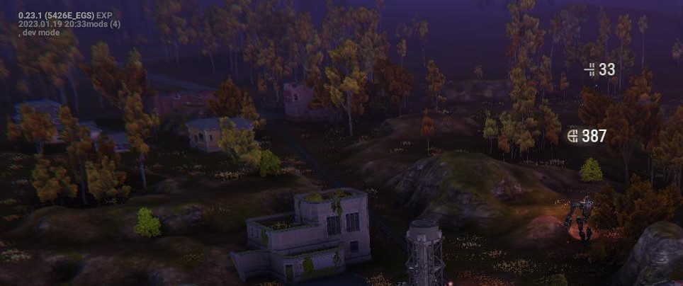

# DamagePopups

A library mod for [Phantom Brigade (Alpha)](https://braceyourselfgames.com/phantom-brigade/) that tinkers with the damage popups to pin them to the corresponding unit and let you see the popups in replay.

It is compatible with game patch **0.23.1-b5426**. That is an **EXPERIMENTAL** release. All library mods are fragile and susceptible to breakage whenever a new version is released.

This mod makes significant changes to how the damage popups are displayed during combat. Here's a rundown of the differences.

- The actual amounts inflicted by shotguns are shown.
- Popups stay pinned to units with inflicted damage instead of drifting away.
- Damage pileups are sorted out so that each damage type can be clearly seen.
- Popup animation is driven by simulation time instead of real time.

In addition, this mod makes it possible to see the popups during replay. This is not enabled by default due to its performance costs. There are a few differences in replay mode.

- The order of the popups for a unit is fixed.
- Barrage damage, accumulated damage or both can be displayed.

This is a minor UI tweak so I used the opportunity to build out parts of the mod that aren't visible to normal players but are of interest to modders.

- Selective logging so you don't spam the log with stuff you don't care about.
- Console commands to assist debugging while the game is running.
- Heavy use of Entitas entities, components and systems.
- Refactor to move logic and state out of UI objects and into ECS.

This is a lengthy readme so feel free to jump to the section that interests you.

- [Screenshots](#screenshots) : several series of screenshots showing what the popups look like
- [Settings](#settings) : how to change the behavior of the mod and turn on various diagnostics
- [Background](#background) : why I started this mod and some details on the original bugs I set out to fix
- [A Word about Animation](#a-word-about-animation) : the difference between driving animations with real time and simulation time
- [Game Design](#game-design) : a look into the mechanic of damage popups from a game design perspective
- [Technical Notes](#technical-notes) : explanation of the technique I'm using to get the popups into replay
- [Refactoring to ECS](#refactoring-to-ecs) : a postmortem on moving logic and state out of the UI and into ECS

## Screenshots

The first sequence of screenshots shows the fix for shotguns, with the proper amounts of damage appearing on the target unit.

Screenshot #1 is just before shooting a tank in the Felheim scenario with a shotgun. This is a two-round shotgun. The enemy tank is selected so you can see its stats.

Screenshot #2 is just after the first round hits the tank. You can see that the hit inflicted 64 points of integrity damage. Looking at the tank's stats, you can see it's spread out all over the tank as you would expect.

Screenshot #3 is just after the second round hits the tank. The number shown has increased because the shotgun fires its rounds rapidly enough in succession for both of them to be considered part of the same "barrage". The unit's stats are now down a noticeable amount.

The second sequence of screenshots shows how the popups fade without drifting away from the corresponding unit. Two units are shown with damage, a tank and a mech.

Screenshot #1 shows the popups quite faded on the mech because it was hit earlier in the turn. The integrity popup on the tank is enlarged, showing that it just took damage from the first round of the shotgun. Pellets from the second round are about to strike the tank.

Screenshot #2 shows the tank after being hit with the second round from the shotgun so its integrity popup has increased but its concussion popup has remained unchanged. The mech's popups are almost entirely faded out.

Screenshot #3 shows how the popups fade out at different times even on the same unit. The tank has just recently received integrity damage but not concussion damage so the concusion popup is starting to fade away. Also notice that the popups stay anchored to the tank instead of drifting up and away. The popups over the mech are now completely gone.

The last sequence of screenshots shows two rounds from a shotgun and the damage popups in replay.

Screenshot #1 is the moment in replay just after the first round from a shotgun hits a tank. You can see the pellets of the second round are just about to hit and a number of the pellets from the first round have missed and struck the ground behind the tank.

Screenshot #2 is a few moments later after the second round has hit the tank. It's easy to see that more of the pellets hit since the number is more than double the one on the first round.

## Settings

There are some settings that can be changed to tweak how the mod works. The `settings.yaml` file should be stored in the same folder as the mod's `metadata.yaml` file.

| Setting Name | Value Type | Description |
| ------------ | ---------- | ----------- |
| samplesPerSecond | integer | sampling rate for positions and inflicted damage; keep this in the range of 16 - 40 |
| textUpdateDelay | integer | how quickly the popups will react to incoming damage; should stay in the range of 1 - 4 |
| popupDisplayTime | float | how long a popup will stay visible after the last hit |
| replayPopups | enum | controls the kind of popup displayed in replay; see below |
| logging | enum | enables logging in different parts of the mod |
| registerConsoleCommands | bool | `true` to register debugging console commands on game startup |

The enumerated values for `replayPopups` determine what kind of popup, if any, will be displayed in replay mode.

| Name | Description |
| ---- | ----------- |
| None | nothing is displayed |
| Barrage | same kind of popup as shown in combat, including a timed fade-out |
| Cumulative | shows the total accumulated damage inflicted on a unit; once a unit has damage, popups will always be shown above it |

The enumeration is a set of flags, so `Barrage` and `Cumulative` can be combined as seen in the following screenshot.

The screenshot shows three units that have sustained damage at some point in the combat.

- A destroyed tank in the upper right corner showing 50 points of concussion damage and 540 points of integrity damage.
- A player mech on the left in the bottom third with 7 points concussion and 159 points integrity.
- An enemy mech under fire near the center with 10 total points concussion and 265 total points integrity.

The enemy mech is the one of interest as it is showing the combined cumulative and barrage damage popups. Two player mechs are currently firing at it.

The unit's concussion popup shows `10/7` which means the unit has incurred 10 points of concussion damage at some point with 7 of those points being inflicted in the current barrage. Similarly, the unit's integrity popup shows `265/197` which tells us that the unit has accumulated 265 points of integrity damage of which 197 have been inflicted so far in the current barrage.

The barrage numbers will fade out if the unit manages to avoid being hit for a period of time but the cumulative values will remain visible in replay until the end of combat.

## Background

This all started with a comment on the Discord channel about how shotguns were doing one point of damage after updating to patch 0.23.1-b5426. BYG had made some significant changes to the damage popups that made them more visible and therefore such problems more noticeable. People knew that, in fact, the shotguns were doing more damage but you had to inspect the unit during the planning phase to see how much the blast actually did.

As I started to look closer at the popups, though, I saw a worse problem, in my opinion. Often the popups would pile up on top of each other, making it hard to see what damage was even inflicted. Here are three examples of the pile from the same combat so this isn't some rare random fluke. In the second screenshot, you can even see a faint second pile-up in the upper right corner.

What finally got me is that the numbers drift away from the units that they started on. In a busy fight you could have piles of drifting numbers and no clue as to which units they belong to. Worse, if you move the camera during combat quick enough, these units will pan with the camera, as if they are painted on the lens of the camera rather than being emitted in the game world. Turns out, that's exactly how these popups work.

I dug into the code before actually thinking about the place these popups have in the game's design. What I found in the code, though, forced me to step back and consider that question. Numbers popping out of things is such a standard trope in games that most normal players don't really give them a second thought. And in a game like Phantom Brigade where the numbers have no material relevance to the game play itself and are solely visual bling, I don't think most players even notice them at all. However, players do notice changes and so tinkering with something like the popups will invite criticism even if the change is completely innocuous. The players will rightly ask what value do they get from this change.

At that point I knew I had to put the popups in replay to give the players some value in exchange for making a cosmetic change. Unfortunately, the added replay logic comes at a heavy performance price so I made it an opt-in setting so that players with potato PCs who just want different damage popups can use the mod without catching their computers on fire and burning down their houses.

## A Word about Animation

The original popups are driven by a real time clock. This is different than how most things are animated in combat. Combat animations tend to use simulation time which is under the player's control. The player can slow down or stop altogether the ticking of the simulation clock. When you stop the clock in combat when popups are on the screen, though, you will notice they will continue to drift and fade away.

I've changed that behavior with this mod. The fade-out time of the popups is tied to the simulation clock. If you stop the clock, the popups will freeze along with the mechs and bullets and trees. Likewise, as combat winds down, the clock slows down and so does the animation of the popups.

## Game Design

Some sort of feedback is usually needed when the player does something in the game. In the case of a mechanic like damage popups, these are useful in arcade games to help the player figure out which things are worth targeting and which things aren't. They also convey a visual sense of progression, as the player can see how much their point totals are increasing. These assessments happen fairly quickly so it helps to keep them coarse. It's easier for players to see that shooting green things gives them 10 points and shooting blue things gives them 100 than to differentiate between 15 and 16 points, respectively. Games outside the arcade genre also use popups and in well-designed games they're germane to how the designers want the players to play the game.

The turn-based nature of Phantom Brigade makes these popups purely cosmetic. When combat starts, the player transitions from an active participant to a passive observer. The simulation will role the dice and dole out damage by the numbers, oblivious to any player input. Combat stops and the player resumes control. The popups have come and gone. They were there merely for amusement, to add some pop to the combat.

It makes little difference to the course of game play if the popups drift away or show inaccurate information or even get all jumbled up. However, they can subtly shade how the player feels about the progress of the combat. This is affect. Popups that drift away can give the feel of the mechs "bleeding" parts all across the battlefield as they dash through hailstorms of bullets. Piled up popups can convey the disorienting sense of being hit by a rapid-fire salvo from a machine gun. The tone I've gone for is a crisp, precise, machine-like feel, a clear-eyed accounting of the damage inflicted and sustained. I don't think it's too dissonant with the tone that the game's developers have chosen but it is different than their tone.

## Technical Notes

The game builds replay by snagging key frames at various points during the simulation. These key frames can be played back with fairly good fidelity with regard to the combat visuals. This technique, though, doesn't give me an easy, minimally disruptive way to hook into it. It's not really meant to keep track of data like damage points so I had to do something different.

I use a simple time-quantization scheme that cuts up the turn into buckets of fixed-length time. As the simulation time advances through each of the buckets, I store the position and damage inflicted in that bucket for each unit. This quantization and tracking cuts into performance so it's only enabled if replay popups are configured in the settings file. The next step is to build lookup tables from the collected samples so that the game responds quickly when the player scrubs through the timeline in replay. Again, building those lookup tables is expensive so I do it only on the first time the replay button is clicked per turn. The default sampling rate of 16 samples per second produces slightly jerky animation that is just barely serviceable for replay. The sampling rate is configurable so that a player who has a burly machine can get smoother animation by increasing the sampling rate.

The popups themselves are just sprites. This is different than the display you see in the planning phase which uses proper UI components. I quickly stumbled over the problem that sprites live in a 2-D space. This is why the original popups would become so drastically detached from their associated units if you moved and zoomed the camera while they're animating. When a popup is first created, it'll take the position of the unit in the world and project it into the UI space where the sprites live. The sprite then moves about in UI space. However, every camera movement and zoom changes the map from UI space to world space. Points in UI space that were at one world point may now be at another world point some distance away. I couldn't come up with a good way to handle camera moves other than to pin the popups to the units.

## Refactoring to ECS

In the original code, the logic and state for the popups lives up in the UI. I moved it down into the ECS as a technical exercise to get a better understanding of the tradeoffs when using Entitas. From a technical design perspective, I prefer to have a thin UI that doesn't have much logic or state in it. UI tends to be the most complex part of any application so anything that reduces that complexity is a design win.

It is not possible to move the logic out of the UI cleanly with a mod. I had to patch in a trampoline method to bounce the message that triggers a popup back to ECS and then build a messy ad hoc class to act as an interface to the UI for the new ECS pieces.

There are a number of places in the code where refactoring the logic out of the UI would be a good thing but I'm on the fence about doing it with a mod. Messy bits tend to lead to unpleasant maintenance experiences and mod maintenance is challenging enough as it is.

I'd advise caution for any other modder considering this route. The UI bits are by far the hardest bits to mod in Phantom Brigade so it is a tempting choice but there's really no good option. If you stay in the UI, you will have to use a lot of reflection to get at the private fields and methods that are the mainstay of proper OO design. If you go ECS, you'll have some rough edges where you interface back into the UI.
